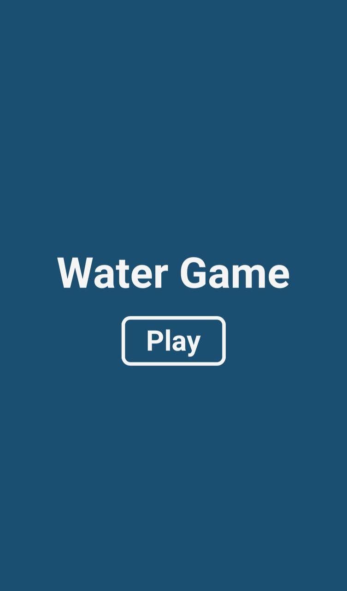
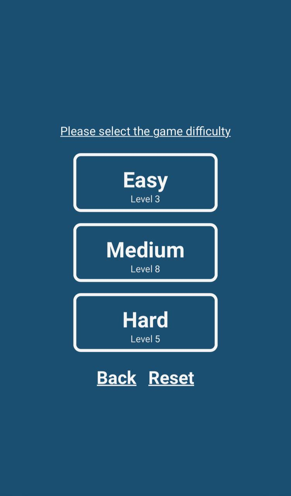
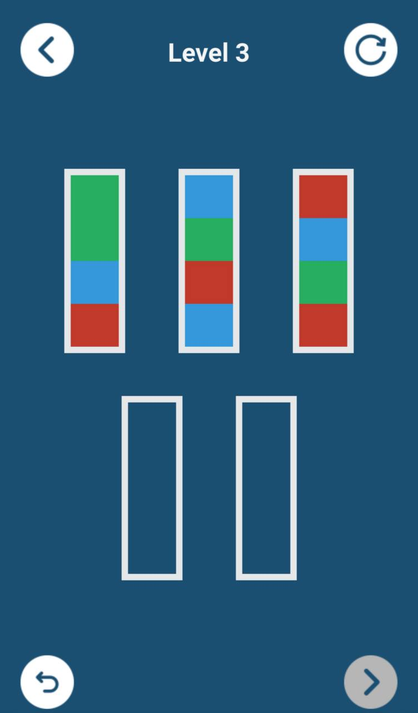
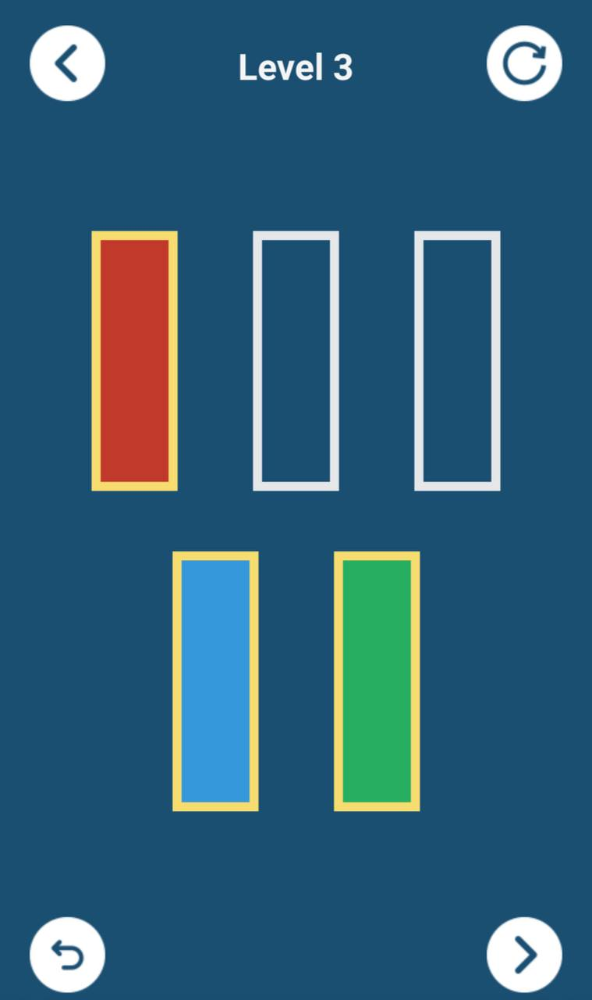
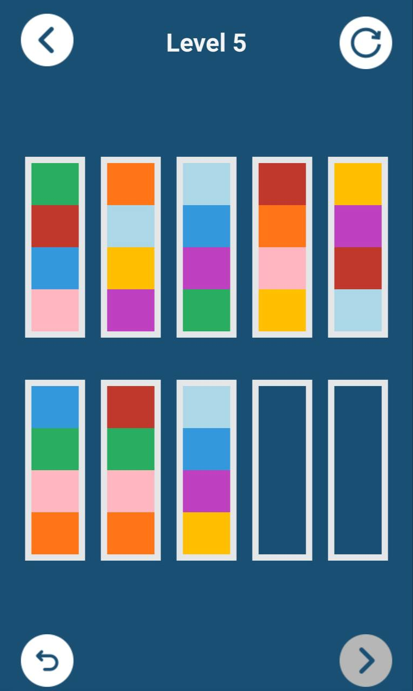

# Water Game

## Description
This is a 2D puzzle browser game where players must sort colored water into bottles, placing each color in the correct container. The game challenges your puzzle-solving skills and provides an interactive experience.

## Technologies
- HTML
- CSS
- JavaScript

## How to Run
1. Clone the repository:
   ```bash
   git clone https://github.com/KreimerR/water-game
   ```

2. Navigate to the project folder:
   ```bash
   cd water-game
   ```

3. Navigate to the `menu` folder:
   ```bash
   cd menu
   ```

4. Open `mainmenu.html` in your browser to start the game.

## How to Play
Sort the colored water into the bottles. Each bottle should contain only one color of water. Click on a bottle to select it, then click on another bottle to pour the water and solve the puzzle.

## Features
- Interactive water sorting
- Restart level option
- Undo last action
- Multiple levels
- Various difficulty levels (Easy, Medium, Hard)
- Reset level option

## Screenshots





